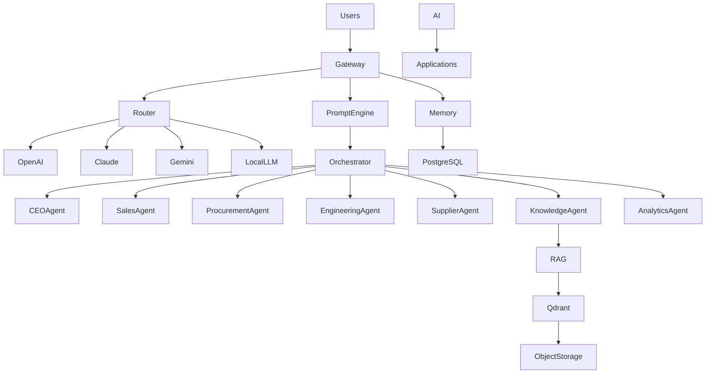

# ETA AI Architecture

## Purpose

This document defines the Artificial Intelligence architecture of the ETA Enterprise Procurement Ecosystem.

AI is a native platform capability, embedded across every business domain rather than implemented as a standalone feature.

The AI platform provides enterprise reasoning, retrieval, automation, recommendations, orchestration, and decision support.

---

# AI Vision

ETA is designed as an Enterprise AI Operating System.

Every business process can invoke AI services while remaining fully governed, secure, auditable, and explainable.

---

# AI Principles

The AI platform follows:

- AI Native
- Human in the Loop
- Retrieval Augmented Generation (RAG)
- Multi-Model Support
- Explainable AI
- Secure AI
- Cost-Aware Routing
- Enterprise Governance
- Continuous Learning
- Vendor Independence

---

# AI Platform Layers

## User Layer

Consumers of AI.

Includes

- Executives
- Sales
- Procurement
- Engineering
- Suppliers
- Manufacturers
- Administrators

---

## AI Gateway

Single entry point for every AI request.

Responsibilities

- Authentication
- Authorization
- Request Validation
- Rate Limiting
- Logging
- Routing

---

## Model Router

Selects the best AI model for each task.

Supported Providers

- OpenAI
- Anthropic Claude
- Google Gemini
- Azure OpenAI
- Ollama
- vLLM
- Future Providers

Routing Criteria

- Cost
- Speed
- Context Length
- Accuracy
- Availability

---

## Prompt Engine

Responsibilities

- Prompt Templates
- Prompt Versioning
- Prompt Variables
- Prompt Testing
- Prompt Governance

---

## RAG Engine

Responsibilities

- Document Loading
- Chunking
- Embedding
- Retrieval
- Re-ranking
- Citation
- Context Assembly

Knowledge Source

Qdrant Vector Database

---

## Memory Engine

Enterprise memory types

### User Memory

Personal preferences.

### Customer Memory

Customer history.

### Supplier Memory

Supplier knowledge.

### Manufacturer Memory

Manufacturer history.

### Procurement Memory

Historical procurement.

### Engineering Memory

Technical knowledge.

### Organizational Memory

Enterprise knowledge.

---

## Agent Orchestrator

Coordinates multiple AI agents.

Responsibilities

- Task Planning
- Agent Selection
- Workflow Execution
- Context Sharing
- Approval Management
- Result Aggregation

---

# Enterprise AI Agents

## CEO Agent

Provides strategic insights and executive summaries.

---

## Sales Agent

Supports opportunity management and customer communication.

---

## Procurement Agent

Supports RFQs, supplier evaluation, and purchasing decisions.

---

## Supplier Agent

Analyzes supplier performance and recommends vendors.

---

## Manufacturer Agent

Maintains manufacturer intelligence.

---

## Engineering Agent

Analyzes technical specifications and datasheets.

---

## Knowledge Agent

Retrieves enterprise knowledge using RAG.

---

## Document Agent

Processes PDFs, drawings, specifications, and contracts.

---

## Analytics Agent

Generates dashboards and business insights.

---

## Compliance Agent

Checks standards, certifications, and policy compliance.

---

## Meeting Agent

Summarizes meetings and extracts action items.

---

# AI Services

Available platform-wide

- Enterprise Chat
- Enterprise Search
- Technical Q&A
- Document Analysis
- Supplier Recommendation
- Product Recommendation
- RFQ Analysis
- Contract Review
- Executive Summaries
- Report Generation
- Translation
- Classification

---

# AI Data Sources

AI consumes data from

- PostgreSQL
- Qdrant
- Object Storage
- Knowledge Base
- Product Catalog
- CRM
- Procurement
- Analytics

---

# Human Approval

Critical decisions always require human approval.

Examples

- Supplier Selection
- Purchase Orders
- Contract Approval
- Financial Decisions

AI provides recommendations only.

---

# AI Governance

Every AI action must be

- Logged
- Auditable
- Explainable
- Versioned
- Traceable

Prompt versions and model selections are recorded.

---

# AI Security

Security controls include

- Data Isolation
- Prompt Protection
- Secret Management
- PII Protection
- Model Access Policies
- Audit Logging

---

# High-Level AI Architecture

---

# Future AI Roadmap

Future capabilities include

- Autonomous Procurement
- Multi-Agent Collaboration
- Voice Assistant
- Vision AI
- Predictive Procurement
- Digital Procurement Twin
- Autonomous Supplier Discovery
- AI Negotiation Support
- Enterprise Knowledge Graph

---

# Long-Term Vision

ETA evolves into a fully governed Enterprise AI Operating System where specialized AI agents collaborate with employees, enterprise knowledge, and business systems to accelerate procurement, improve engineering decisions, preserve organizational knowledge, and enable intelligent enterprise operations while keeping humans in control of critical decisions.