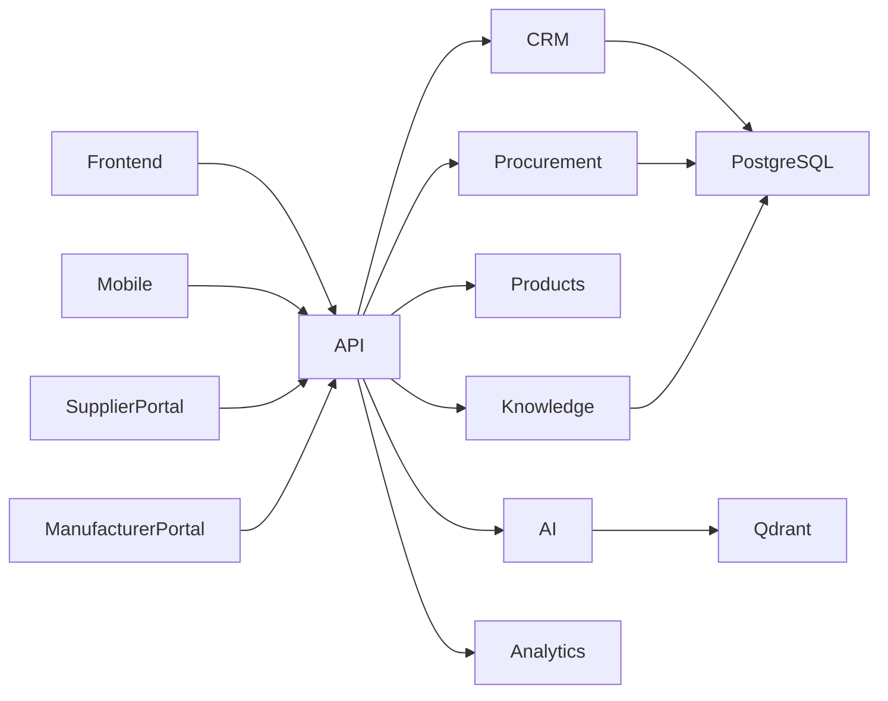

# ETA API Architecture

## Purpose

This document defines the API architecture of the ETA Enterprise Procurement Ecosystem.

All applications, AI services, mobile clients, integrations, and portals communicate exclusively through standardized APIs.

The API layer is the foundation for interoperability, scalability, and future expansion.

---

# API Principles

ETA APIs follow:

- API First
- RESTful Design
- OpenAPI 3.1
- JSON
- Stateless Communication
- Version Controlled
- Secure by Default
- Backward Compatible
- Domain Oriented

---

# API Base URL

Production

https://api.exiratlas.com

Development

https://dev-api.exiratlas.com

Version

/api/v1/

Example

GET

/api/v1/crm/accounts

---

# API Domains

## CRM API

Responsibilities

- Accounts
- Contacts
- Leads
- Opportunities
- Quotations
- Activities

Example

/api/v1/crm

---

## Procurement API

Responsibilities

- RFQs
- Technical Evaluation
- Commercial Evaluation
- Purchase Orders
- Deliveries

Example

/api/v1/procurement

---

## Supplier API

Responsibilities

- Suppliers
- Certifications
- Performance
- Quotations

Example

/api/v1/suppliers

---

## Manufacturer API

Responsibilities

- Manufacturers
- Product Updates
- Certifications

Example

/api/v1/manufacturers

---

## Product API

Responsibilities

- Products
- Categories
- Specifications
- Datasheets

Example

/api/v1/products

---

## Knowledge API

Responsibilities

- Documents
- Standards
- Search
- Knowledge Articles

Example

/api/v1/knowledge

---

## AI API

Responsibilities

- Chat
- RAG
- Enterprise Search
- Recommendations
- Prompt Execution
- Document Analysis

Example

/api/v1/ai

---

## Analytics API

Responsibilities

- Dashboards
- KPIs
- Reports
- Forecasts

Example

/api/v1/analytics

---

## Administration API

Responsibilities

- Users
- Roles
- Permissions
- Organizations

Example

/api/v1/admin

---

# Authentication

Authentication

OAuth2 + OpenID Connect

Tokens

- JWT Access Token
- Refresh Token

Authorization

Role Based Access Control (RBAC)

Future

Attribute Based Access Control (ABAC)

---

# Request Standards

Content Type

application/json

Encoding

UTF-8

Timezone

UTC

Date Format

ISO-8601

---

# Standard Response

```json
{
  "success": true,
  "data": {},
  "message": "",
  "errors": [],
  "meta": {}
}
```

---

# Error Response

```json
{
  "success": false,
  "error": {
    "code": "RFQ_NOT_FOUND",
    "message": "RFQ does not exist."
  }
}
```

---

# HTTP Status Codes

- 200 OK
- 201 Created
- 204 No Content
- 400 Bad Request
- 401 Unauthorized
- 403 Forbidden
- 404 Not Found
- 409 Conflict
- 422 Validation Error
- 500 Internal Server Error

---

# Pagination

Supported Parameters

page

pageSize

sort

filter

search

Example

GET

/api/v1/products?page=1&pageSize=25

---

# Filtering

Example

/api/v1/products?category=pumps

---

# Sorting

Example

/api/v1/products?sort=name

---

# Search

Example

/api/v1/products?search=flowserve

---

# File Upload

Supported

- PDF
- DOCX
- XLSX
- JPG
- PNG
- DWG
- STEP

Storage

S3 Compatible Object Storage

---

# AI Endpoints

Examples

POST

/api/v1/ai/chat

POST

/api/v1/ai/rag

POST

/api/v1/ai/analyze-document

POST

/api/v1/ai/recommend-supplier

POST

/api/v1/ai/summarize

---

# Integration APIs

Supported Systems

- ERP
- CRM
- Email
- Financial Systems
- External Procurement Platforms

Communication

- REST
- Webhooks

Future

- GraphQL Gateway
- Event Streaming

---

# Security

Every API must support:

- HTTPS
- JWT Validation
- Rate Limiting
- Audit Logging
- Correlation IDs
- Input Validation
- Output Sanitization

---

# API Documentation

Documentation Standard

OpenAPI 3.1

Tools

- Swagger UI
- Redoc

SDK Generation

Supported

- TypeScript
- Python
- C#
- Java

---

# High-Level API Flow



---

# Long-Term Vision

ETA exposes a unified, secure, versioned enterprise API platform enabling internal applications, AI services, mobile clients, and third-party systems to communicate through one consistent interface while remaining scalable, maintainable, and technology independent.