# ETA Application Architecture

## Purpose

This document defines every user-facing application within the ETA Enterprise Procurement Ecosystem.

Applications provide specialized user experiences while sharing a common identity, enterprise services, AI platform, and data architecture.

---

# Architecture Principles

Applications are designed to be:

- Modular
- AI Native
- Responsive
- Enterprise Grade
- API First
- Secure
- Scalable
- Role Based

---

# Public Applications

## Corporate Website

Domain

https://exiratlas.com

Purpose

Public corporate website.

Capabilities

- Company Information
- Services
- Industries
- Contact
- Careers
- Knowledge Articles
- Product Information
- Customer Entry Point

---

# Enterprise Applications

## Executive Portal

Primary Users

- CEO
- Executives
- Directors

Capabilities

- Enterprise KPIs
- Executive Dashboard
- Financial Overview
- Procurement Insights
- AI Executive Assistant

---

## CRM Application

Primary Users

- Sales Managers
- Sales Engineers

Capabilities

- Accounts
- Contacts
- Leads
- Opportunities
- Quotations
- Activities
- Pipeline
- AI Sales Assistant

---

## Procurement Application

Primary Users

- Procurement Engineers
- Buyers

Capabilities

- RFQs
- Technical Evaluation
- Commercial Evaluation
- Purchase Orders
- Procurement Workflow
- Delivery Tracking
- Procurement Analytics

---

## Supplier Portal

Primary Users

- Approved Suppliers

Capabilities

- RFQ Response
- Quote Submission
- Document Upload
- Delivery Updates
- Supplier Dashboard
- Notifications

---

## Manufacturer Portal

Primary Users

- Manufacturers

Capabilities

- Product Catalog
- Technical Documents
- Certifications
- Product Updates
- Partnership Dashboard

---

## Knowledge Portal

Primary Users

- Engineers
- Technical Experts

Capabilities

- Enterprise Search
- Technical Documents
- Standards
- Historical Projects
- Lessons Learned
- AI Knowledge Assistant

---

## Analytics Portal

Primary Users

- Managers
- Executives

Capabilities

- Reports
- Dashboards
- KPIs
- Forecasts
- AI Insights

---

## Administration Portal

Primary Users

- Administrators

Capabilities

- User Management
- Roles
- Permissions
- Organization Settings
- Audit Logs
- System Configuration

---

# AI Applications

## AI Workspace

Purpose

Central AI experience.

Capabilities

- Enterprise Chat
- Procurement Assistant
- Engineering Assistant
- Knowledge Search
- Document Analysis
- Recommendation Engine
- Prompt Execution

---

# Shared Enterprise Experience

Every application shares:

- Authentication
- Navigation
- Search
- Notifications
- Files
- Comments
- Activity Timeline
- AI Services

Users experience the ecosystem as one unified platform rather than separate applications.

---

# Mobile Strategy

Future mobile applications include:

- Executive Mobile
- Sales Mobile
- Procurement Mobile
- Supplier Mobile

All mobile applications consume the same enterprise APIs.

---

# User Journey

```mermaid
flowchart LR

Website["exiratlas.com"]

Website --> Login

Login --> ExecutivePortal
Login --> CRM
Login --> Procurement
Login --> SupplierPortal
Login --> ManufacturerPortal
Login --> KnowledgePortal
Login --> AnalyticsPortal
Login --> AdminPortal

ExecutivePortal --> AIWorkspace
CRM --> AIWorkspace
Procurement --> AIWorkspace
KnowledgePortal --> AIWorkspace
AnalyticsPortal --> AIWorkspace
```

---

# Design Principles

Applications should provide:

- Consistent Navigation
- Unified Design Language
- Shared Components
- Minimal Learning Curve
- AI Assistance Everywhere
- Fast Performance
- Accessibility
- Enterprise Reliability

---

# Long-Term Vision

ETA applications function as one integrated digital workplace where users seamlessly move between CRM, Procurement, AI, Knowledge, Analytics, and Collaboration without leaving the ecosystem.