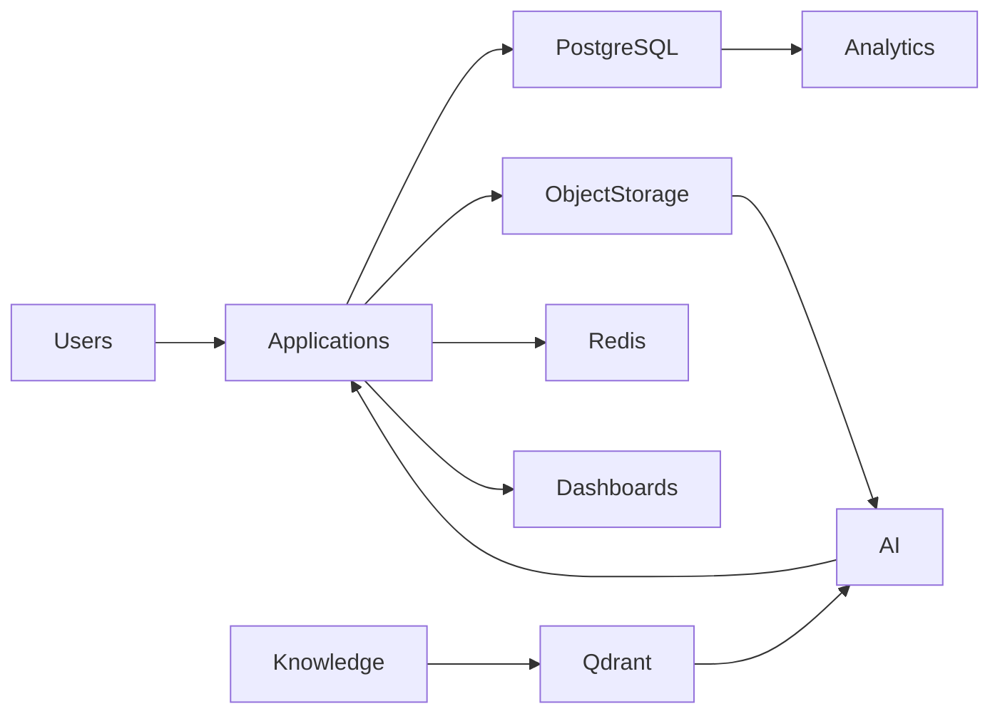

# ETA Data Architecture

## Purpose

This document defines the enterprise data architecture of the ETA Procurement Ecosystem.

It specifies how enterprise data is structured, owned, stored, protected, shared, and consumed by applications and AI services.

The architecture follows a Single Source of Truth (SSOT) strategy while enabling secure and scalable access across all business domains.

---

# Data Architecture Principles

ETA follows these principles:

- Single Source of Truth
- Domain Ownership
- Data Governance
- AI Ready
- Security by Design
- Immutable Audit
- Version Controlled
- Cloud Native
- Scalable
- Vendor Independent

---

# Enterprise Data Layers

## Master Data

Core business entities.

Includes

- Organizations
- Users
- Customers
- Suppliers
- Manufacturers
- Products
- Categories
- Roles
- Permissions

---

## Transaction Data

Operational business activities.

Includes

- Opportunities
- RFQs
- Quotations
- Purchase Orders
- Deliveries
- Supplier Responses
- Evaluations
- Activities
- Approvals

---

## Knowledge Data

Enterprise knowledge.

Includes

- Technical Documents
- Datasheets
- Standards
- Historical Projects
- Lessons Learned
- Engineering Notes
- Knowledge Articles

---

## AI Data

Artificial Intelligence information.

Includes

- Embeddings
- Vector Indexes
- Conversations
- Prompt History
- Recommendations
- AI Memory
- Semantic Relationships

---

## Analytics Data

Reporting and KPIs.

Includes

- Dashboards
- KPIs
- Forecasts
- Aggregations
- Executive Reports

---

# Data Storage Strategy

## PostgreSQL

Primary operational database.

Stores

- Master Data
- Transactions
- Configuration
- Security
- Business Records

---

## Qdrant

Enterprise Vector Database.

Stores

- Embeddings
- Semantic Indexes
- AI Knowledge
- Document Vectors

Purpose

- Enterprise Search
- RAG
- AI Retrieval

---

## Object Storage

S3 Compatible

Stores

- Documents
- Images
- Videos
- Certificates
- Drawings
- Attachments
- Reports

Examples

- MinIO
- Cloudflare R2
- AWS S3

---

## Cache Layer

Technology

Redis

Stores

- Sessions
- Temporary Results
- AI Cache
- Frequently Used Data

---

## Logging Storage

Stores

- Audit Logs
- Application Logs
- Security Logs
- AI Logs
- API Logs

---

# Data Ownership

Each domain owns its master data.

| Domain | Owns |
|---------|------|
| CRM | Customers, Opportunities |
| Procurement | RFQs, Purchase Orders |
| Supplier | Suppliers |
| Manufacturer | Manufacturers |
| Product | Products |
| Knowledge | Technical Documents |
| AI | Embeddings, AI Memory |
| Administration | Users, Roles |

No domain directly modifies another domain's data.

---

# Data Access

Applications access data through:

- REST APIs
- Repository Layer
- Domain Services

Direct database access between domains is prohibited.

---

# Data Governance

The platform enforces:

- Versioning
- Audit Logging
- Change Tracking
- Data Retention
- Backup Policies
- Encryption
- Access Policies

---

# Data Security

All sensitive information is protected using:

- Encryption at Rest
- Encryption in Transit
- Role-Based Access Control
- Row-Level Security (where applicable)
- Secret Management

---

# Backup Strategy

Operational Database

- Daily Backup
- Point-in-Time Recovery

Object Storage

- Versioning
- Replication

Vector Database

- Scheduled Snapshot

Configuration

- Git Version Control

---

# Data Lifecycle

Create

↓

Validate

↓

Store

↓

Use

↓

Analyze

↓

Archive

↓

Retain

↓

Delete (according to policy)

---

# High-Level Data Flow

---

# Future Data Strategy

Future enhancements include:

- Enterprise Knowledge Graph
- Data Lake
- Event Store
- Streaming Analytics
- AI Feature Store
- Digital Twin Data

---

# Long-Term Vision

ETA maintains a unified enterprise data ecosystem where structured, unstructured, analytical, and AI knowledge coexist under governed ownership, enabling intelligent procurement, enterprise search, predictive analytics, and continuous organizational learning.