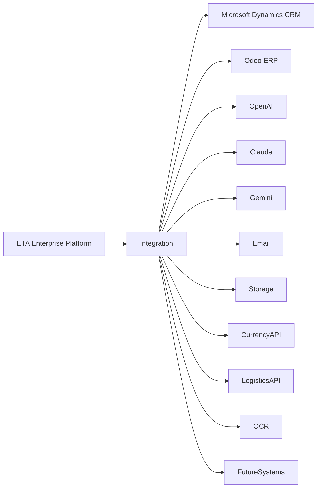

# ETA Integration Architecture

## Purpose

This document defines how the ETA Enterprise Procurement Ecosystem integrates with internal systems, enterprise software, external services, AI providers, and future business platforms.

The integration architecture is designed to ensure loose coupling, high availability, security, and long-term maintainability.

---

# Integration Principles

ETA follows these principles:

- API First
- Adapter Pattern
- Loose Coupling
- Event Ready
- Vendor Independence
- Secure Communication
- Retry & Recovery
- Observability
- Version Controlled

---

# Enterprise Integration Layer

The Integration Layer isolates all external dependencies from the business domains.

No business domain communicates directly with third-party systems.

Every external communication passes through the Integration Layer.

---

# Enterprise Systems

## Microsoft Dynamics CRM

Purpose

Legacy CRM synchronization.

Capabilities

- Customer Synchronization
- Opportunity Import
- Historical Records
- Contact Synchronization

Communication

REST API

Future

Read-only migration support.

---

## Odoo ERP

Purpose

ERP integration.

Capabilities

- Purchase Orders
- Vendors
- Inventory
- Accounting
- Projects

Communication

REST API

Future

Bidirectional synchronization.

---

## SAP ERP (Future)

Purpose

Enterprise ERP support.

Communication

REST API

OData

---

## Oracle ERP (Future)

Purpose

Large enterprise deployments.

Communication

REST API

---

# AI Providers

ETA supports multiple AI providers.

## OpenAI

Capabilities

- Chat
- Embeddings
- Document Analysis

---

## Anthropic Claude

Capabilities

- Long Context
- Reasoning
- Enterprise Writing

---

## Google Gemini

Capabilities

- Multimodal
- Reasoning
- Large Context

---

## Azure OpenAI

Purpose

Enterprise deployments.

---

## Local Models

Examples

- Ollama
- vLLM
- Llama
- Qwen

Purpose

Offline deployments.

---

# Authentication Providers

Supported

- Keycloak
- Auth0
- Microsoft Entra ID
- LDAP
- Active Directory

Future

Single Sign-On across enterprise applications.

---

# Email Integration

Supported

- Microsoft 365
- Exchange
- Gmail
- SMTP

Capabilities

- Notifications
- RFQs
- Purchase Orders
- Reports

---

# Object Storage

Supported

- MinIO
- AWS S3
- Cloudflare R2

Stores

- Documents
- Images
- Drawings
- Certificates
- Reports

---

# Notification Services

Supported

- Email
- SMS Gateway
- Microsoft Teams (Future)
- Slack (Future)
- WhatsApp Business (Future)

---

# External Business APIs

Future integrations

- Currency Exchange APIs
- Logistics APIs
- Shipping APIs
- OCR Services
- Digital Signature Platforms
- Supplier Catalog Services
- Manufacturer Portals

---

# Integration Patterns

## REST APIs

Primary communication mechanism.

---

## Webhooks

Used for:

- Status Updates
- Notifications
- Event Delivery

---

## Scheduled Synchronization

Used when real-time integration is unavailable.

Examples

- Nightly ERP Sync
- Supplier Catalog Updates

---

## Event Driven (Future)

Examples

- Kafka
- RabbitMQ
- Azure Service Bus

Purpose

Enterprise scalability.

---

# Adapter Pattern

Every external system is wrapped by an Adapter.

Example

ERP Adapter

↓

Integration Layer

↓

Business Domain

This prevents vendor lock-in.

---

# Error Handling

Every integration must support

- Retry Policy
- Timeout
- Circuit Breaker
- Error Logging
- Correlation ID
- Monitoring
- Alerting

---

# Security

Every integration requires

- HTTPS
- OAuth2 where supported
- API Keys when required
- Secret Management
- Certificate Validation
- Audit Logging

---

# Monitoring

Every integration is monitored.

Metrics

- Response Time
- Success Rate
- Error Rate
- Retry Count
- Availability

---

# High-Level Integration Diagram

---

# Future Vision

ETA becomes an Enterprise Integration Platform capable of connecting industrial organizations, suppliers, manufacturers, ERP systems, AI providers, and external services through a secure, standardized, and scalable integration layer.