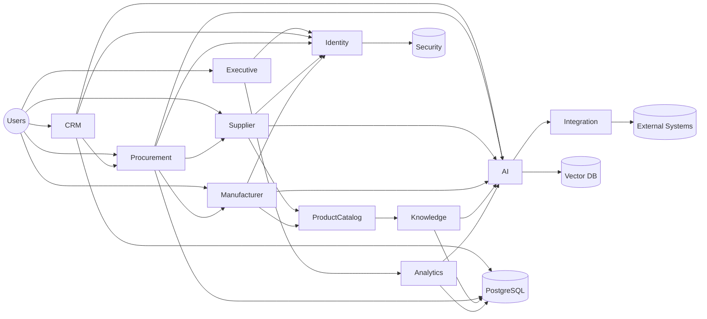

# ETA System Architecture

## Purpose

This document defines the major systems that compose the ETA Enterprise Procurement Ecosystem.

Each system has a clear responsibility, communicates through standardized APIs, and shares enterprise services such as identity, AI, notifications, search, and reporting.

---

# System Overview

The ETA platform is composed of multiple independent systems working together as one ecosystem.

## Core Systems

### Executive System

Purpose

Executive dashboards and strategic decision support.

Responsibilities

- Enterprise KPIs
- Business Health
- Executive Reports
- AI Executive Insights

---

### CRM System

Purpose

Manage customer relationships.

Responsibilities

- Accounts
- Contacts
- Leads
- Opportunities
- Quotations
- Activities

---

### Procurement System

Purpose

Manage industrial procurement operations.

Responsibilities

- RFQs
- Technical Evaluation
- Commercial Evaluation
- Purchase Orders
- Delivery Tracking

---

### Supplier Portal

Purpose

Supplier collaboration.

Responsibilities

- RFQ Response
- Quotations
- Certifications
- Documents
- Communication

---

### Manufacturer Portal

Purpose

Manufacturer collaboration.

Responsibilities

- Product Catalog
- Technical Documents
- Certifications
- Product Updates

---

### Product Catalog System

Purpose

Central industrial product repository.

Responsibilities

- Products
- Categories
- Datasheets
- Standards
- Specifications

---

### Knowledge Platform

Purpose

Enterprise knowledge management.

Responsibilities

- Engineering Knowledge
- Historical Projects
- Lessons Learned
- Standards
- Technical Documents

---

### AI Platform

Purpose

Enterprise Intelligence.

Responsibilities

- AI Assistant
- RAG
- Enterprise Search
- Recommendation Engine
- Workflow Automation
- Document Intelligence

---

### Analytics Platform

Purpose

Enterprise reporting.

Responsibilities

- Dashboards
- Reports
- KPIs
- Forecasting
- AI Analytics

---

### Administration System

Purpose

Platform management.

Responsibilities

- Users
- Roles
- Permissions
- Organizations
- Audit Logs

---

### Integration System

Purpose

External connectivity.

Responsibilities

- ERP
- CRM
- Email
- APIs
- Financial Systems
- AI Providers

---

# Shared Services

Available to every system.

- Identity Service
- Authorization Service
- Notification Service
- Search Service
- File Service
- Audit Service
- Reporting Service
- AI Gateway

---

# Communication Principles

Systems communicate through:

- REST APIs
- Event-driven messaging (future)
- Shared Authentication
- Shared Audit
- Shared AI Layer

No direct database access between systems.

---

# High-Level System Diagram

---

# Design Principles

Every system should be:

- Independent
- Modular
- API First
- AI Enabled
- Secure
- Observable
- Scalable

---

# Future Evolution

The architecture allows future systems such as:

- Finance
- Inventory
- HR
- Project Management
- Quality Management
- Mobile Platform

without changing the existing ecosystem.

---

# Long-Term Vision

The ETA ecosystem becomes a distributed enterprise platform where specialized systems collaborate through shared services, common identity, enterprise knowledge, and AI-powered intelligence while remaining independently scalable.