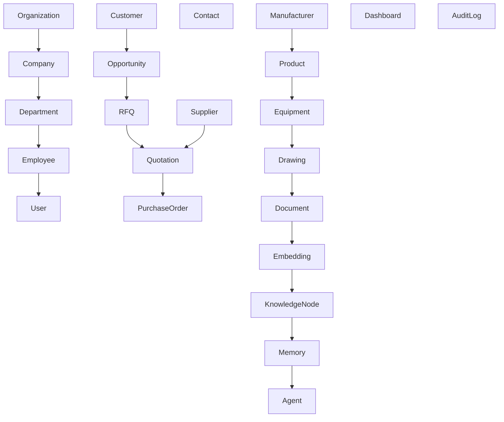

# ETA Enterprise Data Model

## Purpose

This document defines the conceptual enterprise data model of the ETA Enterprise Procurement Ecosystem.

The model represents business entities and their relationships independently of any database technology.

It serves as the foundation for:

- PostgreSQL
- Qdrant
- ERP
- CRM
- AI Memory
- Knowledge Graph
- Analytics
- APIs

---

# Design Principles

The Enterprise Data Model follows:

- Domain Driven Design
- UUID Primary Keys
- AI-Ready Structure
- Master Data Management
- Loose Coupling
- Extensibility
- Multi-Tenant Readiness
- Vendor Independence

---

# Enterprise Domains

The platform is organized into the following data domains.

---

# Organization Domain

Entities

- Organization
- Company
- Branch
- Department
- Business Unit
- Employee
- Position

Purpose

Represents the enterprise structure.

---

# Identity Domain

Entities

- User
- Role
- Permission
- Session
- API Key
- Authentication Provider

Purpose

Identity and access management.

---

# CRM Domain

Entities

- Lead
- Customer
- Contact
- Opportunity
- Activity
- Meeting
- Note

Purpose

Customer relationship management.

---

# Procurement Domain

Entities

- RFQ
- Supplier
- Manufacturer
- Vendor Qualification
- Quotation
- Purchase Order
- Contract
- Purchase Request
- Supplier Evaluation

Purpose

Procurement lifecycle.

---

# Product Domain

Entities

- Product
- Product Category
- Material
- Brand
- Technical Datasheet
- Certificate
- Product Revision

Purpose

Enterprise product catalog.

---

# Engineering Domain

Entities

- Equipment
- Drawing
- Technical Specification
- Revision
- BOM
- Engineering Package

Purpose

Technical information management.

---

# Logistics Domain

Entities

- Shipment
- Delivery
- Incoterm
- Package
- Warehouse (Future)
- Tracking Record

Purpose

Logistics management.

---

# Finance Domain

Entities

- Invoice
- Payment
- Currency
- Exchange Rate
- Tax
- Financial Document

Purpose

Financial integration.

---

# Document Domain

Entities

- File
- Folder
- Attachment
- Version
- Approval
- Document Type

Purpose

Enterprise document management.

---

# AI Domain

Entities

- Prompt
- Conversation
- AI Session
- Agent
- Memory
- Embedding
- Vector Document
- AI Task

Purpose

Enterprise AI platform.

---

# Knowledge Domain

Entities

- Knowledge Node
- Knowledge Relation
- Knowledge Source
- Topic
- Tag

Purpose

Enterprise knowledge graph.

---

# Analytics Domain

Entities

- Dashboard
- KPI
- Report
- Metric
- Data Snapshot

Purpose

Business intelligence.

---

# Audit Domain

Entities

- Audit Log
- Change History
- Approval History
- Login History
- Security Event

Purpose

Compliance and traceability.

---

# Core Relationships

Organization

↓

Departments

↓

Employees

↓

Users

↓

Roles

Customer

↓

Opportunity

↓

RFQ

↓

Quotation

↓

Purchase Order

↓

Contract

Supplier

↓

Quotation

↓

Purchase Order

Manufacturer

↓

Product

↓

Equipment

↓

Technical Documents

Documents

↓

Embeddings

↓

Knowledge Graph

↓

AI Memory

↓

AI Agents

---

# Identifier Strategy

Every entity uses

UUID

Advantages

- Global uniqueness
- Multi-tenant support
- Replication friendly
- Microservice ready
- AI-ready
- Future distributed architecture

---

# Naming Standards

Entity names

PascalCase

Examples

Customer

PurchaseOrder

TechnicalSpecification

Attribute names

camelCase

Examples

createdAt

supplierId

purchaseOrderNumber

---

# Future Expansion

The model supports future domains including

- Manufacturing
- Inventory
- Maintenance
- Quality Control
- Asset Management
- IoT
- Digital Twin

without redesigning the enterprise data model.

---

# Conceptual Data Model

---

# Long-Term Vision

The Enterprise Data Model provides a unified, AI-native, enterprise-grade foundation that enables procurement, engineering, CRM, ERP, analytics, knowledge management, and intelligent automation to operate on a consistent and extensible data architecture capable of supporting future business growth.